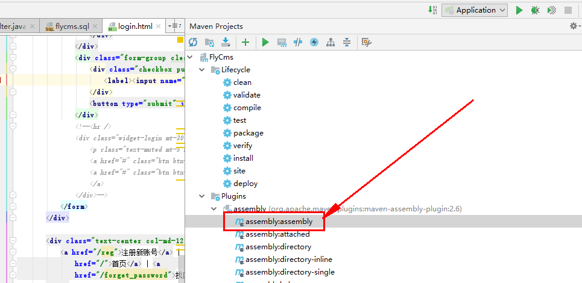
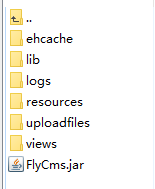
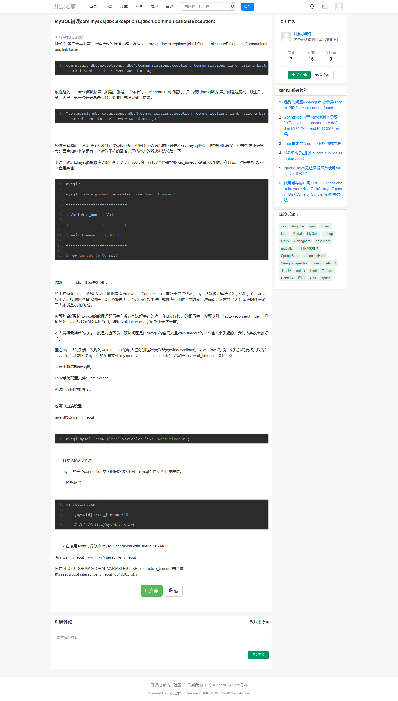
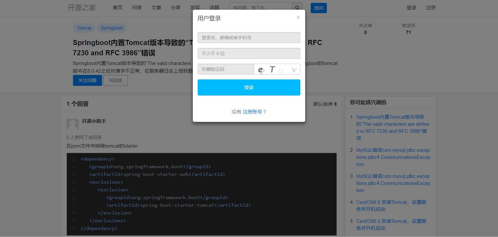

## 项目说明
FlyCms 是一个类似知乎以问答为基础的完全开源的JAVA语言开发的社交网络建站程序，基于 Spring Boot+Bootstrap3+MyBatis+MYSQL+Solr+Ehcache 应用架构，专注于社区内容的整理、归类和检索，它集合了问答，digg，wiki 等多个程序的优点，帮助用户轻松搭建专业的知识库和在线问答社区。 业务模块包括：权限管理，会员管理，角色管理，定时任务管理（调度管理），问答管理，文章管理，分享管理，短信接口管理和邮件系统发送（注册、找回密码、邮件订阅），跨域登录，消息推送，全文检索、前端国际化等等众多模块等您自己来体验！ 
  
##### 开放源码，便捷开发  
基于Spring Boot版本开发，利用成熟开发技术，开放系统源码和开发文档，让二次开发更容易。  

##### 弹性设计，任性定制  
UI设计简约又灵活， Bootstrap定制模板让用户自由发挥，让自己的社区更具独特个性。  

##### 管理后台，轻松掌控
管理后台功能实用简约，只需轻点功能开关，即可完成系统配置，属于你的知识社区一挥而就。

##### 轻快智能，更懂社交  
FlyCms比论坛更开放，比资讯网站更了解用户，以用户为中心，更懂社交，更注重内容的分析和分享。  

##### 用戶互助，精准推送  
用户之间相互解答，分享产品使用心得，只向用户推送自己关心的消息，扩大价值，压缩干扰。  

 

> 使用说明：请保留页面底部的 *powered by 97560. com* 感谢支持


在线地址: [97560.com](http://www.97560.com)

## 技术栈

- JDK8
- Spring-Boot
- MyBatis
- Freemarker
- MySQL
- Bootstrap3
- Solr
- Quartz
- i18n
- Ehcache

## 特性

- 社区兼容性（IE9+）
- 页面自适应布局
- 本地登录，手机注册, 邮件注册
- 登录时有验证码，尝试登录次数的限制
- 使用 `Spring-Boot` 开发
- MyBatis操作数据库
- 目前sql语句只支持MySQL，如果要切换数据库，需要手动修改代码 
- Solr提供搜索和前台部分页面列表查询和分页


## 网站功能
##### 前台功能
- 问答栏目，用户可发布奖励积分邀请回答问题
- 答案发布管理统计等等；
- 文章栏目，专家专栏，后台设置专家组可发布专业性文章资讯
- 文章栏目可分类，文章栏目目前可无限极分类
- 分享栏目，用户可分享发布如百度网盘资源地址，电影地址等等，赚取积分
- 各个栏目话题聚合内容，话题可编辑删除，审核；
- 用户个人首页，可查看自己关注的用户和自己发布的内容
- 用户内容收藏
- 用户积分管理充值
- 用户绑定手机号码
- 用户绑定邮箱地址
- 用户密码找回
- 用户手机号码注册，需后台绑定运营商API；
- 用户邀请注册奖励

##### 网站后台
- 网站运营基本信息编辑
- 用户注册相关信息管理
- 用户手机运营商信息管理（目前只支持阿里大鱼）
- 网站发送邮箱绑定，邮箱模板设置
- 会员信息管理、审核
- 问答管理
- 答案管理
- 文章管理、文章分类
- 话题管理
- 分享管理
- 友情链接管理
- 积分奖励规则管理
- 违禁关键词、敏感词过滤设置
- 增加定时任务管理，通过后台设置启动、关闭，执行任务日志

#### 二次开发准备

1. 开发环境要在IDE里装上lombok插件，否则编译器会报错
2. 程序部署建议使用Maven的assembly插件实现自定义打包方式
3. 项目已经接入了solr，程序安装需要先运行solr，solr已调试好，可直接启动，使用方法可访问官网查看；
4. 项目用到了阿里大于jar包，Maven时无法使用，可以下载doc/dysmsapi.zip，然后放本地的Maven的.m2\repository\com\alibaba\aliyun\目录下
5. 搜索和首页列表后期大部分前台列表准备都使用solr，所以要先下载目录下的solr，然后运行后启动程序，不然报错！

#### solr原来的目录里上传的时候jar文件无法上传，压缩后提示上传文件不能大于10MB

## 如果需要的话进群空间下载，QQ群：`211378508`
## Windows下solr启动  
- 比如solr放E:/盘下面，首先打开CMD窗口
- `e: `回车
- `cd e:/solr/bin` 回车
- `solr start -p 8983` 回车，等待启动成功
- `solr stop -p 8983` 这个是停止solr命令

## Linux下启动
- `cd /root/webapp/solr`
- `./bin/solr start -p 8983 -force` 回车，等待启动成功
- `./bin/solr stop -p 8983 -force` 这个是停止solr命令


- 创建数据库pybbs, 字符集utf8，如果想支持emoji，就要选择utf8mb4字符集（仅限使用MySQL数据库）  
- `git clone https://gitee.com/could/FlyCms` 
- 将项目下的 `/doc/flycms.sql` 文件导入到数据库  
- 前台页面访问 `http://localhost`  
- 后台页面访问 `http://localhost/system/login` 用户名: flycms 密码: 123456  

## 打包部署开发环境  
- 创建数据库flycms, 字符集utf8，如果想支持emoji，就要选择utf8mb4字符集（仅限使用MySQL数据库）  
- 将项目里的application.yml文件复制一份，重新命名application-prod.yml，并修改里面的配置项
- 运行 `mvn clean compile package`  
- 拷贝 `target/FlyCms.jar` 到你想存放的地方  
- 运行 `java -jar FlyCms.jar --spring.profiles.active=prod > FlyCms.log 2>&1 &` 项目就在后台运行了  
- 将项目下的 `flycms.sql` 文件导入到数据库  
- 关闭服务运行 `ps -ef | grep FlyCms.jar | grep -v grep | cut -c 9-15 | xargs kill -s 9`
- 查看日志运行 `tail -200f FlyCms.log`

### 建议用assembly打包方式  

### 前端标签使用示范
```
<@fly_userpower groupName="技术专家组">  
     <nav class="list-group mt30">  
         <a href="/ucenter/article/add" class="list-group-item active">发布文章</a>  
     </nav>  
</@fly_userpower>  
```
  
  
- IDEA打包  
  
- 打包后的的文件目录结构，`resources`目录里只要`application.yml`一个文件就可以了  

  


## 注意事项
- 由于数据库内容被我清空了，有时候我上传的solr里的数据我可能没清空，导致首页及频道页面查询不到数据会报错，解决方法：运行solr前进入`E:\solr\server\solr\info\data` 目录下删除里面的三个文件夹即可，后期会增加后台删除功能  

## 关于主题

本项目配置的结构目录非常方便主题开发，如果你想适配一套自己喜欢的主题，可以按照 `views/templates` 目录下的PC或者移动端的文件夹结构开发，然后进入后台设置新加的模板即可。

## 反馈

原来28844.com我转让了，新的演示网站抽个时间给架设上！（[http://www.97560.com](http://www.97560.com)）

QQ群：`211378508`

*提问题的时候请将问题重现步骤描述清楚*


## 贡献

欢迎大家提 issues 及 pr 

## 页面部分演示截图






## 捐赠


**如果觉得这个项目对你有帮助，欢迎捐赠！**

## License

MIT